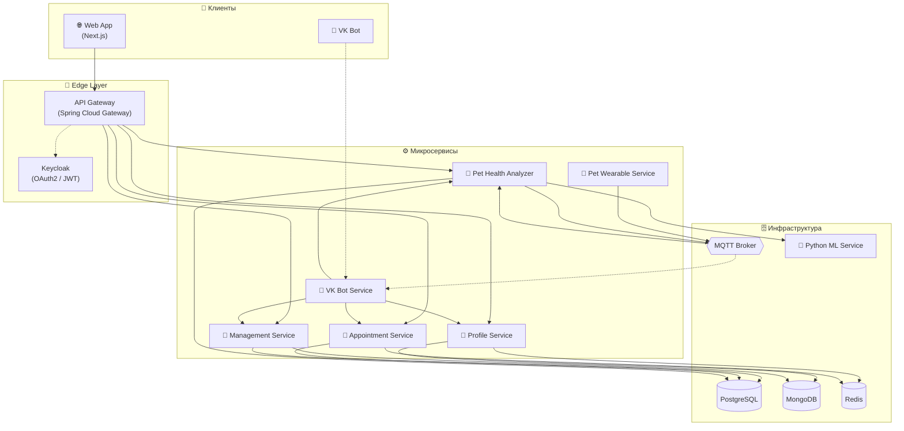

# 🐾 Veterinary Platform


> Единая цифровая платформа для ветеринарных клиник: управление клиникой, мониторинг здоровья питомцев в режиме реального времени и многоканальное взаимодействие с владельцами.

---

## 📋 О проекте

**Veterinary Platform** — распределённая микросервисная система, автоматизирующая ключевые процессы ветеринарной клиники: ведение реестра владельцев и питомцев, управление персоналом и складом медикаментов, запись на приём, сбор телеметрии с носимых устройств (умных ошейников), интеллектуальный анализ здоровья животных и уведомление владельцев через мессенджер.

### Ключевые особенности

- **Микросервисная архитектура** — 6 независимых сервисов, взаимодействующих через REST API и MQTT.
- **Единая точка входа** — API Gateway на Spring Cloud Gateway с маршрутизацией, CORS и логированием.
- **Централизованная безопасность** — Keycloak как OAuth2-сервер, выдача и валидация JWT для всех межсервисных вызовов.
- **Полиглотное хранение** — PostgreSQL для реляционных данных, MongoDB для документо-ориентированных, Redis для кэша и распределённых блокировок.
- **IoT-подсистема** — асинхронная потоковая обработка телеметрии с умных ошейников через MQTT с сериализацией в Protocol Buffers.
- **Машинное обучение** — двухуровневый анализ витальных показателей: пороговые правила + внешний Python-сервис с ML-моделью.
- **Многоканальность** — веб-приложение на Next.js и чат-бот в VK с единым бэкендом.
- **Контейнеризация** — весь стек разворачивается одной командой `docker compose up`.

---

## 🏗 Архитектура



---

## ✨ Ключевые возможности

| Модуль | Возможности |
|---|---|
| 👤 **Профили** | CRUD владельцев и питомцев, привязка VK-аккаунта, генерация QR-кодов для ошейников, публичный доступ к карточке питомца по QR |
| 🏥 **Управление клиникой** | Справочник врачей, учёт медикаментов с автоматическим контролем остатков, фоновый процесс-имитатор поставщика, отзывы о врачах |
| 📅 **Запись на приём** | Гибкое бронирование (врач/время/оба/ничего), автоматический подбор наименее загруженного специалиста, атомарное резервирование слотов, напоминания |
| 📡 **Умные ошейники** | Эмуляция телеметрии (пульс, дыхание, температура, координаты), публикация в MQTT, расчёт расстояния от дома по гаверсинусу |
| 🧠 **Анализ здоровья** | Потоковый приём телеметрии, пороговые правила, ML-классификация аномалий, генерация рекомендаций, REST-история показателей |
| 🤖 **VK-бот** | Long Poll API, стековая навигация, просмотр питомцев и здоровья, запрос анализа за период, экстренные уведомления при аномалиях |

---

## 🛠 Технологический стек

**Backend**
- Java 21, Spring Boot 3, Spring Cloud Gateway
- Spring Data JPA, Spring Data MongoDB, Spring Data Redis, Spring Integration (MQTT)
- MapStruct, Lombok, Liquibase
- Keycloak (OAuth2 / JWT)

**Data & Messaging**
- PostgreSQL, MongoDB, Redis
- MQTT (Eclipse Mosquitto), Protocol Buffers

**ML**
- Python (ML-сервис классификации аномалий)
- ZXing (генерация QR-кодов)

**Frontend**
- Next.js, TypeScript, Zod

**Инфраструктура**
- Docker, Docker Compose
- Railway (деплой)

---

## 🧩 Микросервисы

| Сервис | Назначение | Порт | Документация |
|---|---|---|---|
| **API Gateway** | Маршрутизация, CORS, логирование | 8888 | *[→ README](./services/gateway)* |
| **Profile Service** | Владельцы и питомцы, QR-коды, VK-linking | 8083 | *[→ README](./services/profile)* |
| **Management Service** | Врачи, медикаменты, заказы, отзывы | 8082 | *[→ README](./services/management)* |
| **Appointment Service** | Запись на приём, слоты, напоминания | 8084 | *[→ README](./services/appointment)* |
| **Pet Wearable Service** | Эмуляция умных ошейников, MQTT-публикация | 8085 | *[→ README](./services/pet-wearable)* |
| **Pet Health Analyzer** | Потоковый анализ телеметрии, ML, рекомендации | 8086 | *[→ README](./services/health-analyzer)* |
| **VK Bot Service** | Чат-бот, команды, уведомления | 8081 | *[→ README](./services/vk-bot)* |
| **Frontend** | Веб-приложение личного кабинета | 3000 | *[→ README](./frontend)* |

---

## 🚀 Быстрый старт

### Требования

- Docker 24+
- Docker Compose 2.20+
- 8 GB RAM (рекомендуется)

### Запуск

```bash
# Клонировать репозиторий с субмодулями
git clone --recurse-submodules https://github.com/Cookie-Boy/veterinary-platform.git
cd veterinary-platform

# Создать .env на основе шаблона
cp .env.example .env
# (при необходимости отредактировать переменные)

# Поднять весь стек
docker compose up -d --build
```

После старта доступны:

| Интерфейс | URL |
|---|---|
| 🌐 Веб-приложение | http://localhost:3000 |
| 🔐 Keycloak (админка) | http://localhost:8090 |
| 🚪 API Gateway | http://localhost:8888 |
| 📊 Health checks | `/actuator/health` на каждом сервисе |

### Остановка

```bash
docker compose down
# с удалением томов:
docker compose down -v
```

---

## ⚙️ Конфигурация

Все параметры задаются через переменные окружения в файле `.env`. Пример ключевых переменных:

```env
# PostgreSQL
POSTGRES_HOST=postgres
POSTGRES_PORT=5432
POSTGRES_DB=vet_clinic
POSTGRES_USER=vet
POSTGRES_PASSWORD=change_me

# MongoDB
MONGO_HOST=mongodb
MONGO_PORT=27017

# Redis
REDIS_HOST=redis
REDIS_PORT=6379

# MQTT
MQTT_HOST=mosquitto
MQTT_PORT=1883
MQTT_TOPIC_VITALS=pet/vitals
MQTT_TOPIC_ANALYZED=pet/analyzed

# Keycloak
KEYCLOAK_URL=http://keycloak:8080
KEYCLOAK_REALM=vet-clinic

# Gateway
GATEWAY_HOST=localhost
GATEWAY_PORT=8888
```

Полный перечень — в `.env.example` и в README каждого сервиса.

---

## 📡 API

Все внешние запросы проходят через **API Gateway** (`http://localhost:8888`) с обязательным JWT в заголовке `Authorization: Bearer <token>`.

Публичные эндпоинты (без авторизации):
- `GET /profile/pets/qr-scan/{qrCode}` — карточка питомца по QR-коду.

Основные группы эндпоинтов:

```
/profile/**       → Profile Service
/management/**    → Management Service
/appointment/**   → Appointment Service
/health/**        → Pet Health Analyzer
/bot/notify/**    → VK Bot Service
```

Полное описание API — в README каждого сервиса.

---

## 📁 Структура репозитория

```
veterinary-platform/
├── frontend/                 # Next.js (git submodule)
├── services/                 # Микросервисы
│   ├── gateway/              # API Gateway
│   ├── profile/              # Profile Service
│   ├── management/           # Management Service
│   ├── appointment/          # Appointment Service
│   ├── pet-wearable/         # Pet Wearable Service
│   ├── health-analyzer/      # Pet Health Analyzer
│   └── vk-bot/               # VK Bot Service
├── volumes/                  # Volume-маунты (init-скрипты БД)
├── commit_history/           # Архив истории коммитов
├── compose.yaml              # Prod-сборка
├── compose.dev.yaml          # Dev-сборка
├── .env.example              # Шаблон переменных окружения
├── railway.toml              # Конфигурация деплоя на Railway
└── README.md
```
